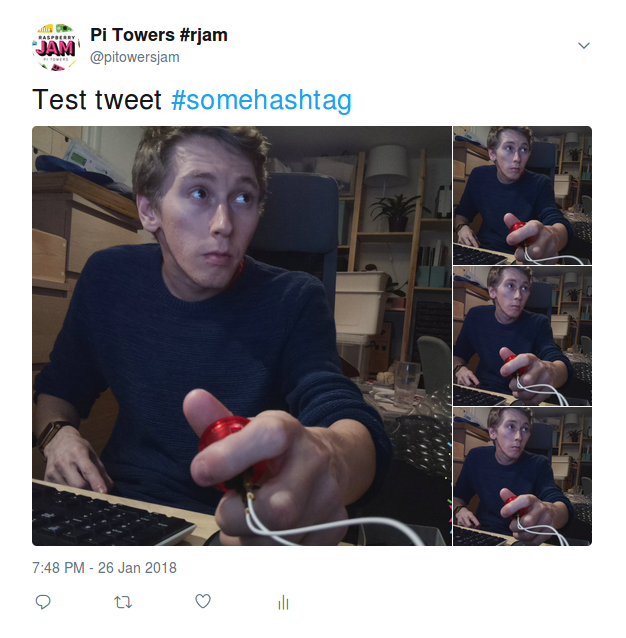
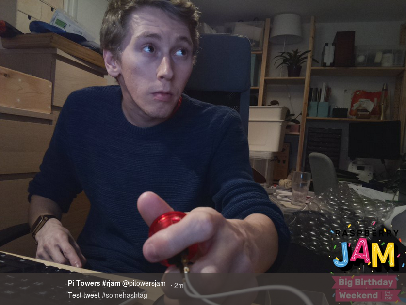

# Raspberry Jam Photobooth

Yet another Raspberry Pi photobooth project. This one is made especially for
Raspberry Jams participating in the [Big Birthday Weekend](http://rpf.io/bday).



Its features include:

- Interactivity provided by text annotations and the push button for control
- By default takes 4 photographs, each controlled by the button
- Tweets the 4 photographs (unless the button is pressed to cancel) with the
Raspberry Jam Birthday logo overlaid in the corner, and a specified message with
the tweet
- Works offline or without Twitter feature if not configured



## Requirements

Hardware:

- Raspberry Pi (any model with a camera port)
- Raspberry Pi camera module
- Any kind of standard GPIO push button ([arcade button](https://www.modmypi.com/raspberry-pi/sensors-1061/buttons-and-switches-1098/arcade-button-30mm-translucent-red)
with [quick-connect wire](https://www.modmypi.com/raspberry-pi/sensors-1061/buttons-and-switches-1098/arcade-button-quick-connect-wires-set-of-10-pairs)
reccomended)

Software:

- Picamera
- GPIO Zero
- Twython

## Automated installation

Open a terminal window and type:

```
curl -sSL http://rpf.io/jampb | bash
```

Note this reboots the Pi at the end of the script, and launches the program
automatically.

## Manual installation

Start with a Raspbian Stretch desktop image.

1. Connect the camera module and wire your button to GPIO14.

1. Enable the camera module using the Raspberry Pi Configuration Tool in the
main menu, or using `raspi-config` on the command line.

1. Reboot.

1. Open a Terminal window.

1. Install the requirements:

    ```
    sudo apt update
    sudo apt install python3-gpiozero python3-picamera python3-pip python3-pil git -y
    sudo pip3 install twython --upgrade
    ```

1. Git clone this repository:

    ```
    git clone https://github.com/raspberrypifoundation/jam-photobooth
    ```

1. Enter the project directory and run the photobooth script:

    ```
    python3 photobooth.py
    ```

1. You should see an image preview appear, and the message:

    ```
    Ready!
    Press the button to start...
    ```

1. Now use the button to progress to the next step, and continue.

1. Without a Twitter API key, the application will not attempt to tweet the
photos. It will simply save the photos in the `Pictures` folder at
`/home/pi/Pictures`.

1. Press and hold the GPIO button for 5 seconds to close the application.

1. To make the program run on boot, add the following entry using `crontab -e`:

    ```
    @reboot python3 /home/pi/jam-photobooth/photobooth.py &
    ```

## Twitter API keys

In order to enable the Twitter feature, you'll need to provide Twitter API keys
for the account you wish the photobooth to tweet from, i.e. your Jam's Twitter
account.

1. Log in to Twitter and ensure a mobile number is added to your account.

1. Go to [apps.twitter.com](https://apps.twitter.com/) and create a new app.

1. Fill out your application details. If you use
`https://github.com/raspberrypifoundation/jam-photobooth` as the website, other
people will be able to see what generated the tweet.

1. Go to `Keys and tokens` and click the `Create my access tokens` button.

1. Open `auth.py` from the project folder and enter your consumer key, consumer
secret, access token and access token secret in the variables provided, e.g:

    ```
    CON_KEY = '0GrZb5jUk9O9KK9W6xhALmNhD'
    CON_SEC = 'CDXCGvmGuMvOBQvvrDZO7lzbj83rDMVpcEnqWYXxkfLGfGrFpL'
    ACC_TOK = '27241881-XPa2YtoA4PwHkIelgYYgMbf24kaEYXj4bp6Ualmk8'
    ACC_SEC = 'ruydKmwQ1ft5fPNkL3AVsOS6EltMdutkek3N80Dlhsjkl'
    ```

    Now when you run `photobooth.py`, it will be able to tweet the photos. There
    is an option to cancel a tweet before it is sent.

    Photos tweeted are still stored in the `Pictures` folder.

    To disable the Twitter feature, simply restore the `CON_KEY` variable to an
    empty string

    **IMPORTANT: Do not share the API keys. Do not accidentally push them to
    GitHub.**

## Languages

Simply edit `text.py`, which contains dictionaries of the strings used as camera
text annotations, and add a copy of the English language dictionary `text_en`
below, renaming it as appropriate. Then replace the dictionary values (right
hand side) with the translated equivalents, leaving the keys (left hand side)
the same.

**Please note that the camera firmware does not support non-ASCII characters.**

To select a language, edit the following line in `photobooth.py`:

```python
text = get_text(language='en')
```

Current language support:

- English - `en`
- German (Deutsche) - `de`
- French (Français) - `fr`
- Spanish (Español) - `es`
- Welsh (Cymraeg) - `cy`

Pull requests with more language support welcome, as are any improvements to
existing translations (they were all done using Google Translate).

## Modifications

Feel free to edit the code to your own specification. Note that the
`JamPiCamera` class is a slightly modified version of `PiCamera` (as you can
see in `jam_picamera.py`).

You may wish to rotate your picture around 180 degrees if your camera is
upside-down. Simply add `camera.rotation = 180` after `camera = JamPicamera()`.

You can also change the overlay image to another image. Just make sure it's the
same size as whatever the camera resolution is set to (here it is set to
`1024x768`).
